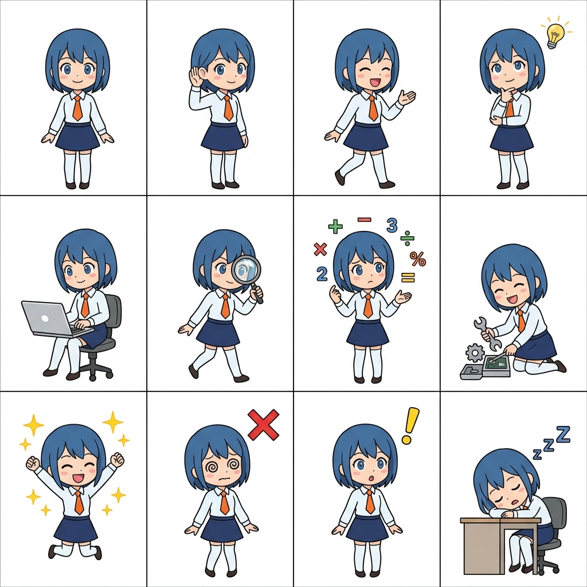

# 🐾 waifu-sprites

**A blazing-fast, 15MB pure-Rust display server for local AI Agents.**

`waifu-sprites` is a lightweight, zero-latency desktop companion UI designed to act as the "**Face**" for headless, agentic LLM orchestrators (like `hermes-agent`). 

It completely abandons the bloated Electron/React ecosystem and complex 3D Live2D rigging in favor of native Rust (**egui**) and a single 4x3 PNG spritesheet.



---

## ⚡ Why this exists
Modern AI agents are incredibly smart (they can write files, execute Python, and search the web autonomously), but their user interfaces are often underwhelming:
- **Boring** command-line terminal windows.
- **Bloated** 500MB+ Web UI wrappers that drain your laptop's battery.
- **Complex** 3D VTuber setups that are fragile and resource-heavy.

`waifu-sprites` fixes this by decoupling the **Brain** (your Python/WSL2 Agent) from the **Face** (this Rust binary). 

* **CPU/RAM Usage:** ~15MB (Idles at 0% CPU).
* **Launch Time:** Instant.
* **Moddability:** You can reskin the entire UI in 30 seconds using Midjourney or MS Paint.

---

## 🏗️ Architecture
`waifu-sprites` acts as a "dumb" visual terminal. It contains zero AI logic. 

1. It runs a local async HTTP server using **Axum** on `localhost:8000/state`.
2. Your AI backend (running in WSL2, Docker, or Python) sends a tiny JSON payload: `{"state": "typing"}`.
3. The Rust **egui** frontend instantly calculates the UV coordinates of a single 4x3 PNG image and draws the corresponding frame.

---

## 🎨 Character System
`waifu-sprites` supports multiple characters via a flexible spritesheet system.

### Single PNG Mode
The default mode uses a single PNG file with a grid of frames. It expects a **4x3 grid** of 12 square frames representing the Agent's current state:

| Grid | Col 0 | Col 1 | Col 2 | Col 3 |
| :--- | :--- | :--- | :--- | :--- |
| **Row 0** | `idle` | `listening` | `speaking` | `thinking` |
| **Row 1** | `typing` | `searching` | `calculating`| `fixing` |
| **Row 2** | `success` | `error` | `alert` | `sleeping` |

### Directory Mode (New!)
You can also organize characters into directories with individual frame files:

```
assets/
├── waifu/
│   ├── 1.png  # idle
│   ├── 2.png  # listening
│   ├── 3.png  # speaking
│   └── ...
├── alternate/
│   ├── 1.png
│   └── ...
└── waifu.png  # also works as single file
```

The app automatically discovers all waifu sets from the `assets/` folder and lets you switch between them via a dropdown menu. Your selection is persisted in `waifu_config.json`.

---

## 🚀 Getting Started

### 1. Build & Run the Frontend
Requires the [Rust toolchain](https://rustup.rs/).

```bash
# Clone and enter the repository
git clone https://github.com/your-repo/waifu-sprites
cd waifu-sprites

# Build and run in release mode
cargo run --release
```
The window will appear showing the `idle` state.

### 2. Connect Your Backend (Python/Node/Bash)
You can test the UI instantly by sending a POST request to the local server.

**From any terminal:**
```bash
curl -X POST http://127.0.0.1:8000/state \
     -H "Content-Type: application/json" \
     -d '{"state": "thinking"}'
```

**From Python:**
```python
import requests

def update_waifu(state):
    requests.post("http://127.0.0.1:8000/state", json={"state": state})

update_waifu("typing")
```

The UI will instantly snap to the corresponding frame of the PNG grid.

---

## 🛠️ Stack
- **Language:** Rust 🦀
- **GUI Framework:** [egui](https://github.com/emilk/egui) / [eframe](https://github.com/emilk/egui/tree/master/crates/eframe)
- **Async Runtime:** [tokio](https://tokio.rs/)
- **HTTP Server:** [axum](https://github.com/tokio-rs/axum)
- **Serialization:** [serde](https://serde.rs/)
